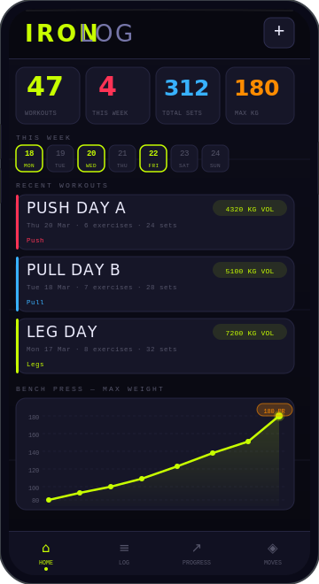

<div align="center">


<p>
  
  
  
  
</p>

<br/>



<br/><br/>

</div>

---

## ⚡ What is IRONLOG?

**IRONLOG** is a zero-BS workout tracker built as a **Progressive Web App** — installs directly on your Android home screen from Chrome, runs fully offline, and never asks you to sign up, pay, or download from a store.

Purpose-built for the **Samsung Galaxy S21 FE** but works on any modern Android or iOS.

---

## 📱 Install in 30 Seconds

```
1. Open   →  https://kingadityaj.github.io/Ironlog
2. Tap    →  ⋮ Menu (top right in Chrome)
3. Tap    →  "Add to Home Screen"
4. Done   →  Launches fullscreen like a native app
```

> No Play Store. No App Store. No account. No ads. Just iron.

---

## 🏋️ Features

| Feature | Details |
|---|---|
| 📓 **Workout Logging** | Log exercises, sets, weight (kg) & reps per session |
| 📅 **Date Tracking** | Every session timestamped with calendar week view |
| 📈 **Progress Charts** | Max weight / volume / reps across every repeated session |
| 📊 **Weekly Tonnage** | Total kg×reps per week bar chart |
| 🥧 **Pattern Split** | Push / Pull / Legs / Hinge / Core / Carry doughnut chart |
| 🏆 **Personal Records** | Auto-detected PRs with 🏆 badge on every exercise |
| 💪 **88 Exercises** | Pre-loaded across all movement patterns & equipment types |
| ➕ **Custom Exercises** | Add your own movements with muscle group tagging |
| 📴 **Fully Offline** | All data in localStorage — no internet after first load |
| 🗑️ **Full CRUD** | Add, view, and delete workouts and exercises freely |

---

## 🗂️ Movement Patterns

```
🔴  PUSH   →  Chest · Shoulders · Triceps          (20 exercises)
🔵  PULL   →  Back · Biceps · Rear Delts            (21 exercises)
🟡  LEGS   →  Quads · Hamstrings · Glutes · Calves  (17 exercises)
🟠  HINGE  →  Posterior Chain · Deadlift Variants   (10 exercises)
🟣  CORE   →  Abs · Obliques · Anti-Rotation        (14 exercises)
🟢  CARRY  →  Full Body · Grip Strength              (3 exercises)
```

---

## 📈 Progress Tracking

IRONLOG tracks your progression **every time you repeat an exercise** — not just week to week. Every session becomes a data point on a chart so you can see exactly when you hit a PR and when volume trends upward.

```
Session 1  →  100 kg   ██████░░░░░░
Session 2  →  105 kg   ███████░░░░░
Session 3  →  107.5 kg ███████░░░░░
Session 4  →  112.5 kg ████████░░░░
Session 5  →  120 kg   █████████░░░  🏆 PR
Session 6  →  125 kg   ██████████░░  🏆 PR
```

Switch between **Max Weight**, **Total Volume**, or **Max Reps** with one tap.

---

## 🛠️ Tech Stack

```
HTML5         →  Single-file PWA, zero build step required
CSS3          →  Custom properties, fluid animations, mobile-first
Vanilla JS    →  No frameworks, no dependencies, no bundler
Chart.js      →  Progress charts and analytics visualizations
localStorage  →  Persistent offline-first data storage
Google Fonts  →  Barlow Condensed + JetBrains Mono
```

---

## 🚀 Deploy Your Own Fork

```bash
# 1. Fork this repository
# 2. Settings → Pages → Source → Deploy from main branch
# 3. Your live URL:

https://[your-username].github.io/Ironlog
```

---

## 📁 Project Structure

```
Ironlog/
├── index.html    ←  The entire app. One file.
├── mockup.svg    ←  README phone preview graphic
└── README.md     ←  This file
```

---

<div align="center">


*Built with obsession. Forged in reps.*

**[🔗 Open IRONLOG →](https://kingadityaj.github.io/Ironlog)**

</div>
